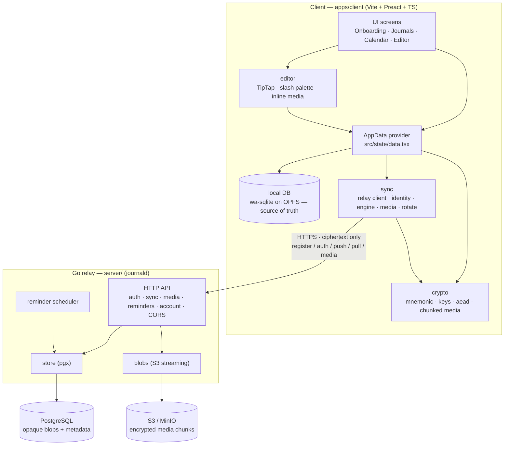
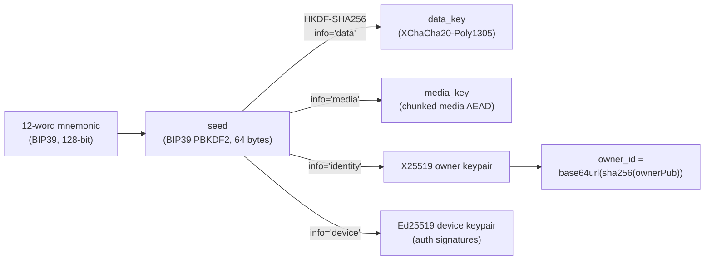
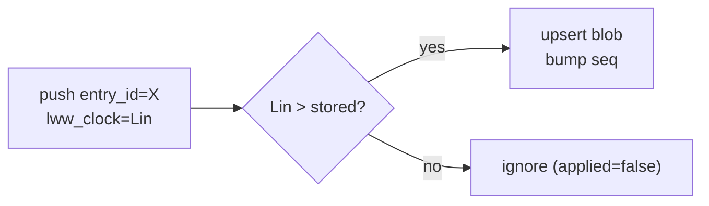
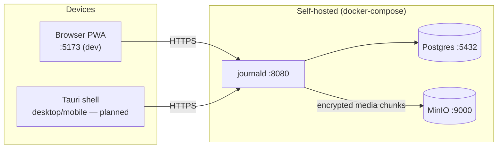

# Architecture

How Mneme is put together, end to end. This describes what exists **today**; planned pieces are
marked _(planned)_. For the locked decisions and their rationale see [`../CLAUDE.md`](../CLAUDE.md);
for the security model see [`SECURITY.md`](./SECURITY.md).

---

## 1. The one-paragraph version

Mneme is a **local-first, end-to-end-encrypted journal**. The client (a Vite + Preact + TypeScript
web app) owns all the cryptography: a 12-word BIP39 mnemonic derives every key, entry bodies and
media chunks are encrypted with XChaCha20-Poly1305 before they leave the device, and the server — a
small Go binary called `journald` — is a **dumb relay** that stores opaque ciphertext blobs keyed by
`owner_id` and compares a single integer (`lww_clock`) to resolve conflicts (media ciphertext is
streamed through to S3/MinIO). The local source of truth is a per-owner wa-sqlite database on OPFS;
the relay is just the courier between devices. The server can never read content, keys, or the
mnemonic. There is no login and no password; the mnemonic *is* the account.

---

## 2. Components



**Trust boundary:** everything inside `Client` is trusted; everything from `Relay` rightward is
**untrusted** (the server operator is an adversary in the threat model). Only ciphertext and metadata
cross the boundary.

---

## 3. Repository layout

```
mneme/
├── CLAUDE.md                  # decision document (source of truth; §1–§12 in German)
├── README.md                  # friendly overview + quick start
├── docs/                      # you are here
│   ├── ARCHITECTURE.md
│   ├── SECURITY.md
│   ├── API.md                 # relay HTTP API reference
│   └── CONTRIBUTING.md
├── docker-compose.yml         # Postgres + MinIO + server
├── apps/
│   └── client/                # the web app (PWA + future Tauri content)
│       ├── src/
│       │   ├── crypto/        # mnemonic, keys (HKDF), aead (XChaCha20), chunked media, base64
│       │   ├── db/            # wa-sqlite on OPFS — durable local store (worker, schema, queries)
│       │   ├── sync/          # relay client, identity, engine (push/pull), media, rotate, ids
│       │   ├── editor/        # TipTap config — toolbar, slash palette, inline media nodes
│       │   ├── state/         # data.tsx — AppData provider (identity, sync loop, outboxes)
│       │   ├── screens/       # Onboarding · Journals · Calendar · Editor
│       │   ├── ui/            # search, templates, capture, lightbox, labels, primitives
│       │   ├── hooks/         # useMediaQuery, useTheme
│       │   ├── data/          # sample seed content + built-in templates
│       │   └── styles/        # design tokens (CSS variables)
│       └── scripts/           # integration.ts + templates-roundtrip.ts (live client↔relay checks)
└── server/
    ├── cmd/journald/          # main: connect → migrate → serve → background workers
    ├── internal/
    │   ├── api/               # handlers, router, Bearer middleware, CORS
    │   ├── store/             # pgx queries + embedded migration runner
    │   ├── reminders/         # scheduler (claims due reminders; logs for now)
    │   ├── blobs/             # media object storage — streams encrypted chunks to S3/MinIO
    │   └── config/            # env config
    ├── migrations/            # forward-only SQL, embedded into the binary
    └── e2e/                   # tagged integration test (needs Postgres)
```

> The `apps/client/src` tree above is the **live** layout. CLAUDE.md §4 shows the larger _target_
> tree (it lists `platform/`, `packages/proto/`, `apps/desktop/` that don't exist yet). Build those
> in the order set by CLAUDE.md §10.

---

## 4. Key derivation

Everything is derived from the mnemonic. Nothing is persisted — re-entering the phrase on a cold
start regenerates the entire identity, including the device key.



- HKDF salt is the constant `"journal-v1"`. Implemented in `apps/client/src/crypto/keys.ts`.
- `owner_id` is computed identically on client and server (`base64url(sha256(ownerPub))`), so the
  account identity needs no separate signup.
- Libraries: `@scure/bip39`, `@noble/curves` (ed25519, x25519), `@noble/ciphers` (xchacha20poly1305),
  `@noble/hashes` (hkdf, sha256). See [`SECURITY.md`](./SECURITY.md) for why.

---

## 5. The ciphertext envelope

Every encrypted blob is **version-prefixed from day one** so primitives can rotate later:

```
┌─────────────┬──────────────────┬─────────────────────────┐
│ version: 1B │ nonce: 24 bytes  │ ciphertext + Poly1305 tag│
│   (0x01)    │ (random)         │                          │
└─────────────┴──────────────────┴─────────────────────────┘
        XChaCha20-Poly1305(data_key, nonce, plaintext)
```

The 24-byte random nonce is why XChaCha20 (not AES-GCM) was chosen: 192-bit nonces make random reuse
negligible. Implemented in `apps/client/src/crypto/aead.ts`. The server stores this whole blob as
opaque `BYTEA` and only ever checks `len >= 1`.

---

## 6. Sync: register → authenticate → push/pull

```mermaid
sequenceDiagram
  autonumber
  participant U as User
  participant C as Client
  participant R as Relay (journald)
  participant DB as Postgres

  U->>C: generate / enter mnemonic
  C->>C: seed = BIP39(mnemonic); derive data/owner/device keys

  rect rgb(244,238,226)
  note over C,R: Registration (trust-on-first-use)
  C->>R: POST /v1/register {ownerPub, devicePub, sig}
  R->>DB: upsert owner + device
  R-->>C: {owner_id, device_id}
  end

  rect rgb(244,238,226)
  note over C,R: Challenge-response auth
  C->>R: POST /v1/auth/challenge {device_id}
  R-->>C: {challenge}
  C->>C: sign(challenge, devicePriv)
  C->>R: POST /v1/auth/verify {device_id, challenge, sig}
  R->>DB: store session (sha256(token))
  R-->>C: {token}
  end

  rect rgb(244,238,226)
  note over C,R: Encrypted sync (Bearer token)
  C->>C: blob = encrypt(data_key, entry JSON)
  C->>R: POST /v1/sync/push {entry_id, lww_clock, ciphertext}
  R->>DB: LWW upsert (compare lww_clock only)
  C->>R: POST /v1/sync/pull {since}
  R-->>C: {entries: ciphertext[], cursor}
  C->>C: decrypt + merge (last-write-wins)
  end
```

- **Auth** is Ed25519 challenge-response. The session token is random; the server stores only its
  SHA-256 hash. Default session TTL 24 h; challenge TTL 2 minutes (single-use).
- **Tenant isolation** lives in the Bearer middleware: authenticated handlers read `owner_id` from
  the session principal, never from the request body.
- The sync engine runs on a 30 s loop in `src/state/data.tsx` and is **offline-tolerant**: if the
  relay is unreachable the app stays fully usable and the vault chip shows "offline".

---

## 7. Conflict resolution — Last-Write-Wins

No CRDT. Each entry carries an `lww_clock` (currently `updatedAt` in ms). The server applies a push
**only if the incoming clock is strictly greater** than what's stored:



Pull uses a monotonic per-row `seq` (a Postgres sequence) as the cursor, so clients ask "give me
everything since seq N". `lww_clock` as wall-clock time is a pragmatic choice with a known tradeoff
(see SECURITY.md and CLAUDE.md §12 — Hybrid Logical Clock vs. Lamport is still `OPEN`).

---

## 8. Data model

### Client (the real, decrypted database — wa-sqlite on OPFS)
The durable local store is **built**: a per-`owner_id` wa-sqlite database on OPFS
(`apps/client/src/db/` — `OPFSCoopSyncVFS` in a worker, forward-only client migrations tracked in
`PRAGMA user_version`). Everything in it is plaintext by design: it exists only on the unlocked
device, and only version-prefixed ciphertext ever syncs (CLAUDE.md §5a).

| Table | Holds | Notes |
|---|---|---|
| `entries` | id, journal, timestamps, title, `body_text`, `body_json` (TipTap), labels, `deleted`, `dirty` | `dirty=1` is the sync outbox; `updated_at` doubles as the LWW clock |
| `media` | id, entry, mime, size, duration, plaintext `data` blob, `synced` | `synced=0` is the upload outbox; `data` is NULL until lazily downloaded |
| `templates` | id, name, body, `builtin` slug, `pristine`, `dirty` | pristine built-in seeds are local-only; edits make them synced records |
| `journals` | id, name, subtitle, color, cover, `pristine`, `dirty`, `record_id` | notebooks sync as encrypted records; `record_id` is the random wire id — the journal id itself (well-known for seeds, date-encoded for user notebooks) stays inside the ciphertext |
| `interview_types` | id, name, intro, prompt, `builtin` slug, `pristine`, `dirty` | same pristine/builtin semantics as templates |
| `media_tombstones` | media ids awaiting relay-side deletion | offline deletes retry until the relay acknowledges |

Full-text search is still substring-based: the published wa-sqlite wasm lacks the FTS5 module, so the
FTS5 table (CLAUDE.md §3) waits on a custom build — the planned migration is sketched in
`src/db/schema.ts`.

### Server (Postgres — opaque + metadata only)
| Table | Holds | Notes |
|---|---|---|
| `owners` | `owner_id`, `owner_pubkey` (X25519) | identity derived from the seed |
| `devices` | `device_id`, `owner_id`, `device_pubkey` (Ed25519) | challenge-response auth |
| `entry_blobs` | `owner_id`, `entry_id`, `lww_clock`, `ciphertext`, `deleted`, `seq` | the LWW oplog; server compares only `lww_clock`. Templates, interview types, journal metadata and the AI-settings singleton ride this same oplog — the record kind is *inside* the ciphertext, so the relay can't tell any of them apart |
| `media_blobs` | `owner_id`, `media_id`, `s3_key`, `bytes`, `chunks` | media index; the encrypted chunks themselves live in S3/MinIO |
| `reminders` | `owner_id`, `reminder_id`, `fire_at`, `dispatched` | `fire_at` is **cleartext** (accepted leak) |
| `push_subs` | push endpoints per device | _(planned use)_ |
| `auth_challenges` | short-lived challenges | single-use, TTL'd |
| `sessions` | `sha256(token)`, `owner_id`, `device_id`, `expires_at` | raw token never stored |

Migrations are **forward-only** and embedded into the binary (`server/migrations/`, applied on
startup by `internal/store/migrate.go`).

---

## 9. Runtime topology



Several hundred users × E2EE is effectively free server-side: the relay does no content indexing, no
rendering, and no heavy queries — load is I/O, not CPU (CLAUDE.md §7).

---

## 10. What's built vs. planned

The full, current status board — built, planned, and deliberately-not-building — lives in
[ROADMAP.md](./ROADMAP.md), and the complete feature list is in [FEATURES.md](./FEATURES.md). A
snapshot of the load-bearing pieces:

| Area | Status |
|---|---|
| UI (4 screens, responsive, 6 skins × 6 accents, light/dark/system) | ✅ built |
| Localization — 12-language UI (incl. RTL Arabic), device-local | ✅ built |
| Crypto (BIP39 → keys → XChaCha20 AEAD, chunked media) | ✅ built |
| Seed at-rest sealing — Argon2id passphrase + FIDO2/WebAuthn PRF, auto-lock | ✅ built |
| Relay (auth, LWW push/pull, media relay, reminders CRUD, account deletion, CORS) | ✅ built |
| Client ↔ relay encrypted sync (offline outbox, dirty flags) | ✅ wired |
| Durable local DB (wa-sqlite on OPFS, per owner, schema v8) | ✅ built |
| TipTap editor — rich text, tables, code highlighting, math, wikilinks + backlinks | ✅ built |
| Media — video/audio, images/galleries/lightbox, files, location maps (encrypted, MinIO) | ✅ built |
| Templates, multiple journals, interview types (encrypted, ride the entry oplog) | ✅ built |
| Vault-wide search (⌘/Ctrl+K) | ✅ built (substring) |
| Recovery-phrase rotation + account wipe | ✅ built |
| AI assistant (Anthropic + Ollama; ask / write / guided interviews; off by default) | ✅ built |
| Day One import | ✅ built |
| Admin dashboard, operator vault deletion, backup + restore (CLI + admin) | ✅ built |
| Production deploy stack (Caddy + compose.prod), self-hosted fonts, runtime relay URL | ✅ built |
| FTS5 full-text index | 🔜 blocked on a custom wa-sqlite wasm build |
| Tauri desktop + mobile shells (Track A foundation done) + OS-keychain seal | 🔜 in progress |
| Reminders UI + local scheduled notifications | 🔜 next |
| Export / non-Day-One import | 🔜 later |
| CSP, rate limiting, HLC/Lamport clock, AEAD framing binding | 🔜 security backlog |
| `packages/proto` shared wire-format | 🔜 later (JSON for now) |
