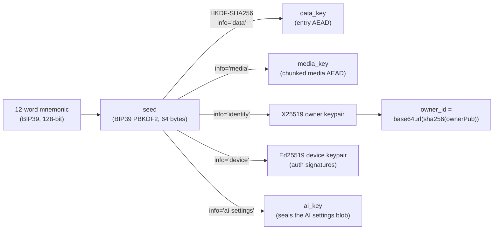

# Encryption

How Mneme turns your words into ciphertext nobody else can read — the primitives, the key hierarchy,
the on-the-wire envelope, and how keys are (and aren't) stored. This is the *how it works* companion
to [SECURITY.md](./SECURITY.md)'s *what it protects and from whom*. If you only read one line: **all
cryptography happens on your device, once, for every client, and the server does exactly one crypto
operation — verifying a signature — and never decrypts anything.**

Everything here is implemented in `apps/client/src/crypto/`. The relay contains no decryption code,
because there is nothing it could decrypt with; giving it keys would be like handing the night guard a
combination he's contractually forbidden to remember.

---

## 1. The building blocks

One boring, audited primitive per job. Boring is the compliment here.

| Purpose | Primitive | Library |
|---|---|---|
| Recovery phrase | BIP39, 128-bit entropy, 12 words | `@scure/bip39` |
| Seed → keys | HKDF-SHA256 (salt `"journal-v1"`) | `@noble/hashes` |
| Entry & media encryption | XChaCha20-Poly1305 (AEAD), random 24-byte nonce | `@noble/ciphers` |
| Owner identity | X25519 (for future sealed-box device pairing) | `@noble/curves` |
| Device auth | Ed25519 (challenge-response signatures) | `@noble/curves` |
| Hashing / IDs | SHA-256 | `@noble/hashes` |
| At-rest passphrase seal | Argon2id (64 MiB, t=3, p=1) | `@noble/hashes` |

**Why `@noble` / `@scure` (paulmillr):** audited, dependency-light, **synchronous** (no wasm init
dance), and tree-shakeable. This is a recorded override of the project's original "libsodium-wasm"
choice (CLAUDE.md §3, 2026-06-09); the primitives themselves are unchanged from §6.

**Why XChaCha20-Poly1305, not AES-GCM:** the 192-bit (24-byte) nonce makes a random-nonce collision
negligibly unlikely, so we never need a nonce counter or careful nonce bookkeeping — historically one
of the more reliable ways to turn AEAD into a public disclosure. XChaCha20 lets us generate a random
nonce per message and never think about it again.

---

## 2. Key derivation — the mnemonic is the whole tree

Everything descends from the 12 words. Nothing below the mnemonic is persisted by default: re-entering
the phrase on a cold start regenerates the entire identity, device key included.



- The HKDF salt is the constant `"journal-v1"`. Implemented in `crypto/keys.ts`.
- `owner_id` is computed identically on client and server (`base64url(sha256(ownerPub))`), so account
  identity needs no signup — the phrase *is* the account.
- The device key is **derived** from the seed (`info="device"`), not generated per device, so the
  mnemonic alone reconstructs a working device. (Trade-off: effectively one logical device identity per
  mnemonic today; true per-device keys are a later refinement — see [SECURITY.md](./SECURITY.md) §4.)

---

## 3. The ciphertext envelope

Every encrypted blob — entry body, media chunk, sealed seed, AI settings — is **version-prefixed from
day one**, so a primitive can be rotated later without guessing what an old blob was sealed with:

```
┌─────────────┬──────────────────┬──────────────────────────┐
│ version: 1B │ nonce: 24 bytes  │ ciphertext + Poly1305 tag │
│   (0x01)    │ (random)         │                           │
└─────────────┴──────────────────┴──────────────────────────┘
        XChaCha20-Poly1305(key, nonce, [aad]) over the plaintext
```

Implemented in `crypto/aead.ts` (`encrypt` / `decrypt`, both taking an optional `aad`). The server
stores this whole blob as opaque `BYTEA` and its deepest cryptographic insight is `len >= 1`.

**A note on AAD (associated data):** the envelope *supports* authenticated-but-not-encrypted context,
and **media chunks use it** — each chunk binds its media id and chunk index, so a relay can't shuffle
or splice chunks undetected. **Entry bodies do not yet bind their framing** (`entry_id` / `deleted` /
`lww_clock`) into the AEAD; that's a tracked hardening item — see [SECURITY.md](./SECURITY.md) §6.1.
Honesty over polish.

---

## 4. What gets encrypted, and where the metadata hides

The trick that keeps the relay clueless: anything that would leak meaning is folded *inside* the
encrypted body, and only genuinely opaque handles cross the wire.

- **Entry body** — title, ProseMirror JSON, labels, the entry's own date/time — all sealed under
  `data_key`. Only a **random 128-bit hex `entry_id`**, the `lww_clock`, and a `deleted` flag travel in
  cleartext (the ids are random precisely so chronology doesn't leak — see below).
- **Media** — encrypted in ~1 MiB chunks under `media_key`, each chunk with its own nonce and an AAD
  binding `(media_id, chunk_index)`. This lets the relay serve range requests over ciphertext without
  learning anything. The mime type, duration, plaintext size, and which entry it belongs to all live
  inside the *entry* body, not the media index.
- **Templates, journals, interview types, AI settings** — these ride the **same entry oplog** as
  encrypted records. The record *kind* lives inside the ciphertext, so the relay cannot tell a template
  from an entry from a notebook. This is why shipping them required zero server changes.
- **The AI API key** — sealed under `ai_key` (HKDF `info="ai-settings"`) with AAD
  `mneme:ai-settings:v1`, stored in the IndexedDB keystore and synced as an encrypted record. A
  different vault's blob fails the AEAD tag and is simply treated as unconfigured.

### Why entry IDs are random, not ULIDs

The relay sees `entry_id` in cleartext. A ULID or any timestamp-encoded id would therefore leak your
writing chronology to the one party you don't trust. So ids are **random 128-bit hex**
(`src/sync/ids.ts`). This intentionally diverges from the "ULID" wording in CLAUDE.md §5a/§11 — the
§3 leak-guard wins, and it's called out as a hard guardrail in CLAUDE.md §0.

---

## 5. Keys at rest — three honest options

While unlocked, keys *must* live in process memory — that's unavoidable for any client-side crypto,
and no amount of marketing changes it. At rest, you get to choose how paranoid to be:

1. **Nothing persisted (default).** The identity lives in memory only; you re-enter the mnemonic on
   every cold start. Maximum paranoia, minimum convenience.
2. **Argon2id passphrase seal** (opt-in, record `v:1`). The BIP39 seed is sealed under an Argon2id
   passphrase-derived key (64 MiB / t=3 / p=1 → XChaCha20-Poly1305, standard envelope, purpose-binding
   AAD) and stored in IndexedDB (`crypto/seedlock.ts`, `platform/keystore.ts`). Cold start asks for the
   passphrase; a wrong one fails the AEAD tag. KDF parameters live inside the record so they can be
   raised later without breaking old seals. **Caveat, stated plainly in the UI:** this sealed record is
   offline-brute-forceable by whoever steals the disk — the slow KDF and your passphrase strength are
   the only things standing there.
3. **FIDO2 / WebAuthn PRF security-key seal** (opt-in, record `v:2`). The seed is sealed under a secret
   obtained from a hardware authenticator (YubiKey, platform passkey) via the WebAuthn **PRF
   extension** (`platform/webauthn.ts` runs the ceremony; the 32-byte PRF output is HKDF'd into the
   wrap key). Unlike the passphrase record, this is **not** offline brute-forceable — the secret only
   ever exists inside the authenticator.

Only one seal method is active at a time; switching (passphrase ⇄ security key ⇄ off) lives in
Preferences → Vault → "Device unlock" and replaces the old seal only after the new one succeeds.
Phrase **rotation re-seals** the new seed under the kept method with no extra ceremony (and clears the
seal if that fails — a record that would "unlock" into a wiped old identity is worse than none).

The seal is strictly a **device-unlock convenience**. The mnemonic remains the only account and
recovery anchor; "use my recovery phrase instead" always works.

> **Planned:** the Tauri shells add a `v:3` seal whose wrap secret lives in the **OS keychain**
> (Stronghold), gated by biometrics — same version-prefixed contract, just a different place to keep
> the wrap secret. See [ROADMAP.md](./ROADMAP.md).

**The local database itself is plaintext** on disk (a per-owner wa-sqlite DB in OPFS), by deliberate
local-first design — it only exists on the unlocked device. OS disk encryption is what stands between
a device thief and that file. This is an accepted trade-off, tracked in [SECURITY.md](./SECURITY.md)
§6.11.

---

## 6. Device auth (the one thing the server verifies)

- **Registration** binds an `owner_id` (from the seed) to a device's Ed25519 public key. The device
  signs `"mneme:register:" || ownerPub || devicePub` to prove it holds the device private key. It is
  **trust-on-first-use** (and today does not prove *seed* possession — see [SECURITY.md](./SECURITY.md)
  §6.5).
- **Challenge-response**: the relay issues a random, single-use, 2-minute challenge; the device signs
  it; the relay verifies against the stored device pubkey and issues a random **session token** (24 h
  default), storing only `sha256(token)`. A database leak yields no usable tokens.

Verifying that Ed25519 signature is the *entire* cryptographic contribution of the server. It is,
frankly, doing the bare minimum, and that is exactly the job description.

---

## 7. Recovery-phrase rotation (the "my phrase leaked" path)

A mnemonic can't be changed in place — every key and the `owner_id` derive from it. So "Replace
recovery phrase" (`sync/rotate.ts`) performs a **full migration**:

1. Generate a fresh 12-word phrase and derive a new identity.
2. **Re-encrypt every entry and media object** under the new keys.
3. Push them to the relay as a **brand-new owner**.
4. Only once the whole vault is safely stored under the new identity, `DELETE /v1/account` wipes the
   old owner (Postgres cascade + best-effort S3 chunk cleanup) and the old per-owner OPFS DB is
   destroyed locally.

The old account stays intact until that final step, so an interrupted rotation loses nothing and
retrying with the same new phrase is idempotent. Afterwards the leaked phrase authenticates (TOFU)
into an *empty* vault. The one thing rotation **cannot** do is retract copies an attacker already
exfiltrated while the old phrase was valid — encryption is not time travel.

---

## 8. Threats, caveats, and the honest asterisks

This document describes the mechanism. For the adversary model, the accepted metadata leaks, and the
known gaps (browser-delivered-code risk, no CSP yet, AAD not binding entry framing, wall-clock
`lww_clock`, etc.), read [SECURITY.md](./SECURITY.md) — it is deliberately not written to flatter the
project. For where the code lives and how the pieces connect, see
[ARCHITECTURE.md](./ARCHITECTURE.md).
